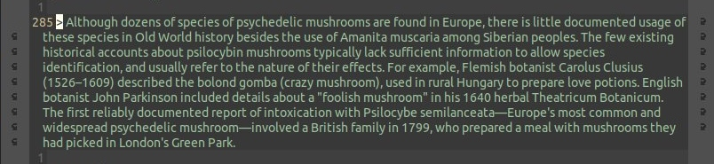

vim: fdl=3:

# zenburn-theme for Emacs

[![License GPL 3][badge-license]](http://www.gnu.org/licenses/gpl-3.0.txt)

## About
My fork of the excellent [zenburn-emacs](https://github.com/bbatsov/zenburn-emacs), created just so that I can tweak basic coloring `fringe` to be dimmer.

### how
The original theme uses `zenburn-fg`
```
    ...
;;;;; basic coloring
    ...
    (fringe ((t (:foreground ,zenburn-fg :background ,zenburn-bg+1))))
    ...
;;; Color Palette
    ...
    ("zenburn-fg"       . "#DCDCCC")
    ...
    ("zenburn-bg-1"     . "#2B2B2B")
    ...
```
I switch to `zenburn-bg-1`, which gives less obtrusive fringe marks.



### install
I symlink this repository to `~/.emacs.d/harriott-zenburn-emacs` then in my [init.el](https://github.com/harriott/misc/blob/master/Emacs/init.el) I have:
```lisp
; (use-package zenburn-theme)  ; gets the original
(require 'zenburn-theme)  ; gets this version
  (load-theme 'zenburn t)
```
I noticed that whenever I tweak my copy of the theme Emacs warns me that it considers "The local variables list in zenburn-theme.el contains values that may not be safe (*)." My workaround is to briefly switch back to the original theme.

## License
Copyright © 2010-2022 Bozhidar Batsov and
[contributors](https://github.com/bbatsov/zenburn-emacs/contributors).

Distributed under the GNU General Public License, version 3

[badge-license]: https://img.shields.io/badge/license-GPL_3-green.svg
